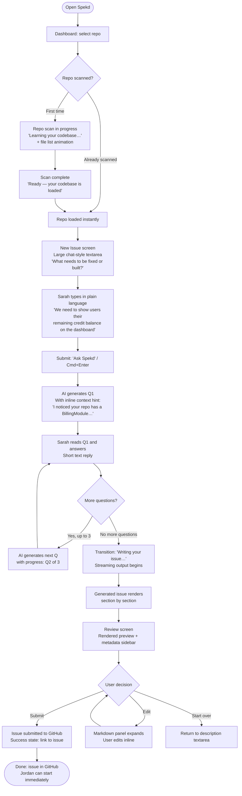
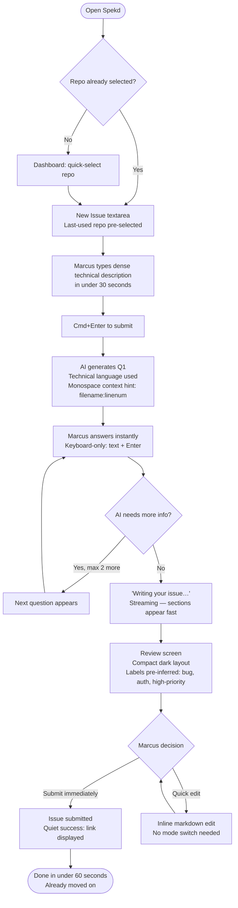
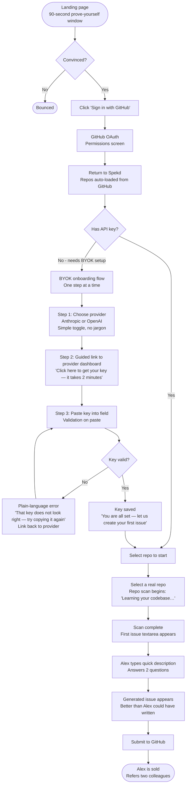
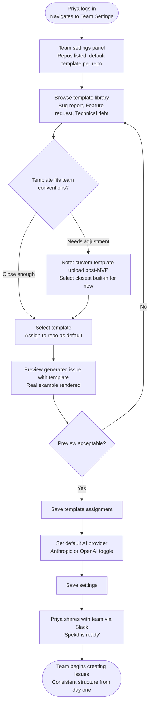
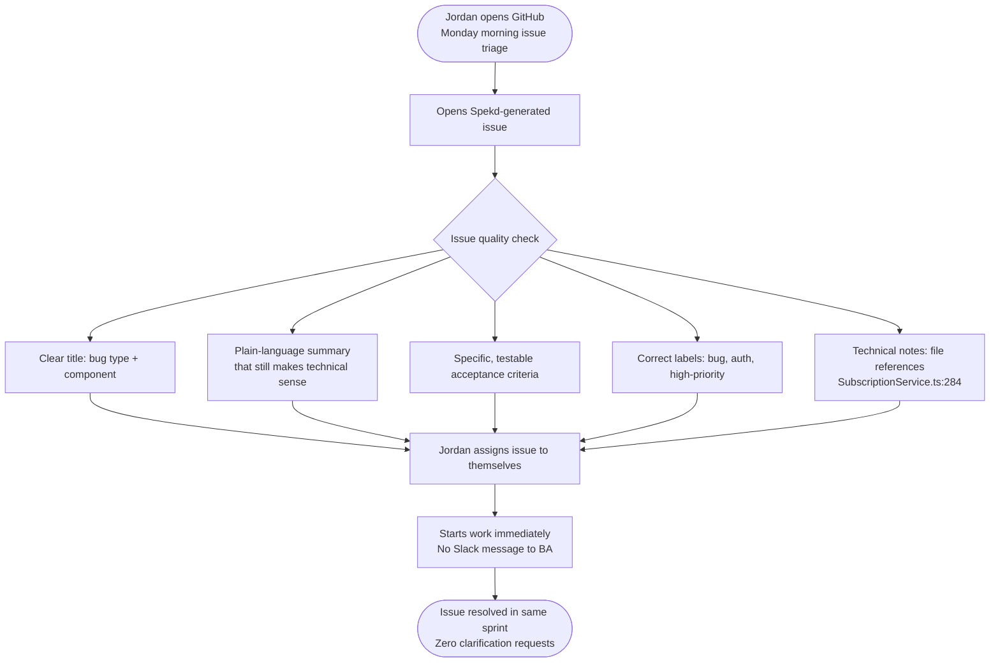

# UX Design Specification — Spekd

**Author:** ChiaLung Liu
**Date:** 2026-03-03

---

<!-- UX design content will be appended sequentially through collaborative workflow steps -->

## Executive Summary

### Project Vision

Spekd is a full product lifecycle platform — **"Your idea, fully spekd."** — that takes users from a rough idea to fully implemented code across three product phases: **PLAN** (guided product planning), **CREATE** (AI-powered issue creation), and **BUILD** (agentic implementation).

The CREATE phase (Product Phase 1) is the core that ships first: an AI issue interrogator that front-loads the developer clarification conversation into the moment of issue creation. Instead of generating content from what a user has already written, the AI asks targeted, repo-aware questions *before* generating anything. The result lands in GitHub as a structured, context-complete issue that requires zero follow-up from the receiving developer.

The PLAN phase (Product Phase 0) extends this upstream: non-technical founders and PMs describe their product idea, and Spekd walks them through generating a complete PRD, architecture spec, UX spec, and prioritised epics and stories using pluggable planning methods (BMAD Method is the first adapter). Planning artifacts flow directly into CREATE as enriched context.

The BUILD phase (Product Phase 2) extends downstream: created issues are assigned to AI agents or developers with full planning and creation context attached.

The core UX challenge is serving two very different mental models through a single product: non-technical users who need guidance and confidence, and developers who need speed and precision. The role self-selection at onboarding ("I'm a developer" / "I'm not a developer") is the primary lever. Every design decision downstream must honour both paths genuinely.

> **Build Phase vs Product Phase:** Build Phase 1 (MVP) delivers Product Phase 1 (CREATE). Build Phase 2 delivers Product Phase 0 (PLAN) + Teams. Build Phase 3 delivers Product Phase 2 (BUILD) + Growth. UX patterns described in this document cover all phases, with Build Phase 2/3 content clearly marked as future.

### Target Users

**Non-technical creators (Sarah the BA, Alex the freelance PM)**
Users who know *what* they need but not how to express it in developer language. Motivated by not feeling like the bottleneck. Low tolerance for complexity, potential mobile usage, may rely on assistive technology. The product must make them feel capable and heard — not overwhelmed by GitHub conventions or AI jargon.

**Non-technical founders and planners (Nadia the co-founder)** *(future — Build Phase 2)*
Users with a product vision but no technical background. They need to go from "I know what I want" to "here's exactly what to build." They enter through Phase 0 (PLAN) and need a guided, non-intimidating workflow that produces professional-quality planning artifacts. Their CTO or dev team is the downstream consumer.

**Developer creators (Marcus)**
Users who already know the answer and want to get it structured fast. The clarification loop must feel precise and quick, not hand-holdy. Speed is respect for their time. A 45-second issue creation is a win; a 3-minute one is an insult.

**Developer receivers (Jordan)**
Never use Spekd directly but experience its output in GitHub. Their ability to act on an issue without follow-up is the downstream UX success metric. Spekd cannot control GitHub's UI — but it controls the structure, formatting, and completeness of what it submits.

**Team leads and admins (Raj the team lead, Priya the admin)** *(future — Build Phase 2)*
Users who set up shared workspaces, manage team permissions, configure defaults, and ensure consistency across their team's planning and issue creation. They need clear admin controls and visibility into team activity without micromanaging.

### Key Design Challenges

1. **The dual-persona problem** — the same core flow must feel approachable to Sarah and fast to Marcus. These are conflicting UX instincts. Role self-selection at onboarding ("I'm a developer" / "I'm not a developer") is the key lever, but both paths must be designed with genuine care, not just different copy.

2. **Making the clarification loop feel like help, not interrogation** — each question must feel obviously relevant, answerable without developer knowledge (for non-technical users), and fast. The 3-question maximum is a UX constraint as much as a product constraint.

3. **Streaming AI output as a deliberate interaction** — the transition from "answering questions" → "generation in progress" → "review your issue" is a three-act UX flow requiring deliberate choreography. Partial streamed text must feel like progress, not confusion.

4. **BYOK onboarding for non-technical users** — asking a non-developer to obtain an API key from Anthropic or OpenAI is a significant drop-off risk. The guided flow is load-bearing UX, not an afterthought.

5. **The first-scan wait as a trust-building moment** — on first repo add, a full code scan runs. The waiting experience must communicate value ("I'm learning your codebase so I can ask smarter questions"), not just show a spinner.

6. **Phase 0 planning workflow for non-technical users** *(future — Build Phase 2)* — guiding a founder through generating a PRD, architecture spec, UX spec, and epics without overwhelming them with technical concepts. The multi-step planning workflow must feel progressive and achievable, not like a requirements-gathering ordeal.

7. **Team workspace onboarding and permissions** *(future — Build Phase 2)* — making team setup fast (under 15 minutes to first shared issue) while maintaining clear role-based permissions (Owner/Admin/Member) that feel obvious, not bureaucratic.

### Design Opportunities

1. **The clarification loop as the brand moment** — this is Spekd's signature interaction. Questions that feel eerily relevant, answers that are quick to give: if this loop feels magical, it becomes the thing users talk about. It is worth significant design investment.

2. **Trust through transparency** — showing users *why* the AI asked a particular question ("I noticed your repo has a billing module…") transforms the experience from "AI guessing" to "AI understanding." Explainability as delight.

3. **Jordan's passive experience** — Spekd controls the structure and formatting of what it submits to GitHub. A well-crafted issue that renders beautifully in GitHub's markdown is itself a UX deliverable — one that lands in front of every developer who receives a Spekd issue.

4. **Onboarding as product demo** — Alex's first session *is* the marketing moment. The onboarding flow should feel like a live demo that proves value, not a setup wizard that delays it. Zero friction to first issue is the UX north star.

5. **Planning as guided discovery** *(future — Build Phase 2)* — Nadia's planning workflow should feel like a structured conversation, not a requirements document. Each planning step (PRD → Architecture → UX → Epics) builds visibly on the previous one, giving the user a sense of momentum and tangible progress.

6. **Team workspace as shared context** *(future — Build Phase 2)* — Raj's team workspace should make collaboration feel lightweight — shared artifacts, shared repos, and shared defaults without the overhead of traditional project management tools.

## Core User Experience

### Defining Experience

The ONE thing users will do most frequently — and the interaction that must be absolutely right — is the **issue creation flow**: describe a need → answer AI questions → review and submit. Everything else (onboarding, settings, history) exists to make this possible or better.

The critical sub-interaction is the **AI clarification loop**: the moment a question appears and the user answers it. This is where the product earns or loses trust. Three times, per issue, every issue. Get it right and users feel understood. Get it wrong and they feel interrogated or confused.

### Platform Strategy

- **Primary platform: web, desktop-first.** Issue creation maps best to a desktop/laptop context where users are already in their work environment.
- **Mobile: fully functional, not an afterthought.** Non-technical users may reach for their phone. The clarification loop and issue review must be genuinely usable on small screens.
- **Input modality: keyboard + mouse primary; touch supported.** Clarification answers are short text inputs — keyboard-native but touch-friendly.
- **No offline functionality.** All core flows require GitHub API and AI provider connectivity.
- **Web-only.** No native app for MVP or foreseeable future.

### Effortless Interactions

These must require zero conscious effort:

- **Repo auto-discovery after OAuth** — repos are just *there* after sign-in. Manual entry is a fallback, not the default.
- **Answering clarifying questions** — each answer feels like a quick chat reply, not a form. Short text inputs; possibly quick-reply suggestions for common answers.
- **Submitting the final issue** — one clear action, no second-guessing. The edit step is safety, not friction.
- **Template selection** — the right template is suggested automatically based on the description. Users should not have to think about which template applies.

### Critical Success Moments

| Moment | Why It's Make-or-Break |
|---|---|
| First clarifying question appears | If it feels irrelevant or confusing, trust is lost immediately and the core promise fails |
| Generated issue appears on screen | The "wow" moment. Generic output = product has failed. Accurate, well-structured output = user is sold. |
| BYOK setup for non-technical user | Highest drop-off risk in onboarding. Too technical = churn before ever experiencing the product's value. |
| First repo scan completes | The transition from "scanning…" to "ready" must feel like something valuable happened, not just a spinner that disappeared. |
| Issue lands in GitHub | Jordan's Monday morning experience. Formatting, structure, and completeness is Spekd's quality on display. |
| First planning artifact generated *(future)* | Nadia sees her rough idea transformed into a structured PRD. If it feels generic, trust is lost. If it reflects her specific domain, she's sold. |
| Team workspace first shared issue *(future)* | Raj's team feels the value of shared context. If setup was painful or the first shared issue feels no different from a solo one, the team value prop fails. |

### Experience Principles

1. **Front-load trust, not friction.** Every moment before the first generated issue should build confidence, not add steps. If users must do something difficult (BYOK), the surrounding context must make the payoff feel worth it.

2. **Questions that feel like insight.** Each clarifying question should feel like it came from someone who already read the codebase — because it did. If the AI's questions could have been written without looking at the repo, they've failed. The question *is* the product in this moment.

3. **Speed is a form of respect.** For developer users, every unnecessary word, extra click, or delay without visible progress is a trust withdrawal. The product should feel faster than writing the issue yourself.

4. **The edit step as confidence, not doubt.** The review-and-edit screen should make users feel *in control*, not like the AI got it wrong. Framing: "Here's your issue — looks good?" not "Please review for errors."

5. **Persona adapts, product stays the same.** The core flow is identical for Sarah and Marcus. What changes is language, context depth, and pacing. The product never feels like it has two modes — just one mode that meets users where they are.

## Desired Emotional Response

### Primary Emotional Goals

Spekd serves two distinct user types with different primary emotional goals — design must honour both without compromising either.

**Non-technical creators (Sarah, Alex):** Primary emotion is **capability** — *"I can do this. I know what I need and now I can actually say it properly."* Secondary emotion is **relief** — the weight of "I'm going to get this wrong again" is lifted. Users should feel like full participants in the development process, not translators who keep getting things returned.

**Developer creators (Marcus):** Primary emotion is **efficiency** — *"That was faster than doing it myself."* Secondary emotion is quiet **confidence** that the output is good enough to hand off without second-guessing the format, labels, or structure.

**Shared north star:** After submitting an issue, every user should feel a small but genuine sense of **accomplishment** — the satisfying click of something done properly.

### Emotional Journey Mapping

| Stage | Non-Technical User (Sarah) | Developer User (Marcus) |
|---|---|---|
| First discovery / landing page | Curious but guarded — "could this work for someone like me?" | Mildly sceptical — "is this just another AI wrapper?" |
| OAuth sign-in + repo load | Relieved by simplicity — "oh, that was easy" | Neutrally efficient — just getting past the gate |
| BYOK setup | Anxious → guided flow must convert to "ok, I can do this" | Unfazed — knows exactly what to do |
| First code scan | Intrigued — "it's actually looking at my project?" | Mildly impressed if fast; annoyed if slow |
| Clarifying questions appear | **Pivotal**: "these make sense" (trust earned) or "I don't understand" (trust lost) | "Good questions, quick answers" — efficiency validated |
| Generated issue appears | **The wow moment**: "this sounds like what I meant but better" | Satisfaction — "yep, correct and properly formatted" |
| Submit to GitHub | Pride — "I did that. And it's good." | Done. Next. |
| Returning to use again | Comfort and routine — part of how they work now | Habit — it's in the workflow |

**Planning Journey Emotions** *(future — Build Phase 2)*

| Stage | Non-Technical Founder (Nadia) |
|---|---|
| Selects planning method | Curious but cautious — "will this actually understand my idea?" |
| Describes product idea | Hopeful — "this is my chance to finally articulate this properly" |
| Planning questions appear | Surprised and relieved — "these are the right questions to ask" |
| First artifact (PRD) generated | **The wow moment**: "my CTO could actually use this" |
| Completes full planning workflow | Accomplishment — "I went from idea to spec. I'm a real product person." |
| Flows into Phase 1 (CREATE) | Confidence — "the issues I create will be informed by my plan" |

**Team Journey Emotions** *(future — Build Phase 2)*

| Stage | Team Lead (Raj) |
|---|---|
| Creates team workspace | Efficient optimism — "let me get this set up for the team" |
| Invites team members | Satisfied if fast; frustrated if any invitation bounces |
| Configures team defaults | Control — "now everyone will be consistent" |
| Team creates first shared issue | Validation — "this is better than our old process" |

### Micro-Emotions

- **Confidence vs. confusion** — Every clarifying question must land clearly. A confused non-technical user guesses, and the output suffers. Confusion here is the single biggest micro-failure risk.
- **Trust vs. scepticism** — Trust is built incrementally: scan completed, questions were relevant, output was accurate. Each step either deposits or withdraws from the trust account.
- **Accomplishment vs. frustration** — The edit step before submission is where frustration can spike if output is poor. Accomplishment arrives when the user reads the issue and thinks "yes, exactly."
- **Delight vs. satisfaction** — Satisfaction is the baseline ("it worked"). Delight is the goal ("it understood my project"). Delight happens when a question or output reference surprises with its specificity — "how did it know about the billing module?"

### Design Implications

| Emotional Goal | UX Design Approach |
|---|---|
| Capability for non-technical users | Plain-language questions with no jargon; progress indicators framing each step as achievable; no dead ends |
| Efficiency for developer users | Minimal copy, fast inputs, no unnecessary screens; clarification answers submittable with keyboard alone |
| Trust through relevance | Questions visibly reference the repo/codebase; optional "why did you ask this?" micro-disclosure per question |
| Accomplishment on submission | Clear success state; immediate GitHub link; small celebration moment — not flashy, just right |
| Relief from uncertainty | AI-assisted badge + edit step reinforce user is always in control; nothing submits without their review |
| Delight through specificity | Technical notes reference actual file names; questions reference real module names — specificity is the delight mechanism |

### Emotional Design Principles

1. **Make non-technical users feel like insiders, not outsiders.** Plain language, no GitHub jargon in the user-facing flow, and an output the user fully understands.

2. **Let silence speak for developers.** Marcus doesn't need celebration or hand-holding. The fastest path through is the best experience. Emotional design for developers means getting out of the way.

3. **Build trust in steps, not all at once.** Each stage (scan, question, generation) is a trust checkpoint. Design each transition as an earned step forward.

4. **Protect the wow moment.** The generated issue appearing on screen is the product's singular emotional peak. Nothing before it should drain attention or energy.

5. **Errors should feel recoverable, not catastrophic.** If a scan fails, an API key is wrong, or generation errors — the response should be "ok, I can fix this," not "this is broken." Clear error states with obvious next actions.

## UX Pattern Analysis & Inspiration

### Inspiring Products Analysis

**GitHub (Issue Tracking)**

GitHub is the destination, not the competition — but it is the product Spekd users know best. Its UX strengths are also its weaknesses in this context:

- *What it does well:* Markdown-native issue format; label and milestone taxonomy; comment threading; keyboard shortcuts for power users; the issue form is familiar to developers.
- *What creates friction for Spekd's users:* The blank textarea. GitHub presents a form and leaves the quality entirely to the author. Non-technical users stare at it not knowing what to write. Developers write serviceable but incomplete issues because the form asks for nothing specific. GitHub's form trusts the user to know what a good issue looks like — most don't.
- *Lesson for Spekd:* The rendered output in GitHub must feel native — correct labels, proper markdown formatting, standard section headings. Spekd wins trust by making its submissions look like they were written by a senior developer who knows GitHub conventions deeply. Users must not be able to tell Spekd wrote it; they must think *they* wrote it well.

**ChatGPT (AI Chat for Writing Assistance)**

The product millions of Spekd's users reach for when they need help expressing something clearly.

- *What it does well:* Conversational input with zero friction — users type naturally and get structured output. The chat metaphor lowers the stakes of every input. Progressive disclosure through dialogue. Streaming output creates a sense of responsiveness and trust. The "thinking…" indicator sets expectations.
- *What creates friction:* Users have to know how to prompt it. Non-technical users often get generic output because their input was generic. There's no context about their specific codebase. The conversation has no memory of the project.
- *Lesson for Spekd:* Adopt the low-stakes, conversational input tone — users should feel like they're chatting, not filling a form. But the AI's questions carry the context ChatGPT lacks. Spekd asks ChatGPT-style questions that are infused with repo awareness. The streaming output pattern creates the same responsive feel that ChatGPT users already trust.

**Figma (Collaborative Design Tool)**

Used heavily by Sarah's UX/design counterparts and increasingly by non-technical product stakeholders.

- *What it does well:* Progressive disclosure through layered complexity — simple on the surface, powerful underneath. "Inspect" mode vs. "design" mode serves different mental models. Real-time progress and status indicators that feel alive, not blocking. Sidebar-based navigation that keeps context without consuming the canvas. Commenting as a lightweight collaboration layer.
- *What creates friction:* Onboarding cognitive load for non-designers. The tool's power can feel overwhelming before the user finds their groove.
- *Lesson for Spekd:* Progressive disclosure is the right pattern for the dual-persona problem. Sarah sees the surface; Marcus can go deeper if he wants. The layout approach — a persistent context sidebar with a primary working canvas — maps well to Spekd's issue creation flow: repo/template context on one side, active work on the other. Real-time, animated status indicators (not static spinners) make the AI feel alive.

**Cursor (AI-Native Code Editor)**

The product most likely to have already earned developer trust with Spekd's technical user segment.

- *What it does well:* AI that understands your codebase — the core promise Spekd shares. Inline suggestions that feel contextually relevant, not generic. The "accept/reject" interaction pattern for AI-generated content: power without obligation. Fast, keyboard-first flow. The chat pane for asking questions feels productive, not interruptive. Transparency about what the AI is looking at.
- *What creates friction:* Developer-native UX that excludes non-technical users by default. Requires existing technical literacy.
- *Lesson for Spekd:* The "accept / edit / reject" pattern for AI-generated content is already familiar to developer users — use it for the generated issue review. Showing *what the AI read* (the files it referenced) creates the same transparency and trust Cursor builds with its context window display. For developer users, this is a feature; for non-technical users, it's optional depth they can ignore.

### Transferable UX Patterns

**Conversational Input Pattern (from ChatGPT)**
- Replace form fields with natural-language prompts wherever possible
- The initial issue description input: large, unformatted, chat-style textarea — not a titled form
- Apply to: issue description entry; clarification question answers

**Streaming Output with Purposeful Pacing (from ChatGPT + Cursor)**
- Render the generated issue progressively — section by section, not all at once
- Include a subtle "composing…" state between question submission and generation start
- Apply to: the generated issue appearing on screen; the wow moment choreography

**Accept / Edit / Reject for AI Content (from Cursor)**
- The generated issue review is not an edit screen — it's a confirmation screen with easy editing available
- Primary CTA: "Submit to GitHub" (accept). Secondary: inline edit. Escape hatch: "Start over"
- Apply to: the entire post-generation review step

**Progressive Disclosure by Role (from Figma)**
- Non-technical users see plain language; developer users can reveal technical depth
- "Why did the AI ask this?" disclosure behind a small toggle — optional, not prominent
- Apply to: clarification question display; generated issue technical notes section

**Context-Aware Sidebar (from Figma + Cursor)**
- Persistent left panel showing: active repo, selected template, questions answered so far
- Right/main panel: the active step (answering questions → generating → reviewing)
- Apply to: the full issue creation flow layout

**Inline Progress as Value Communication (from Figma + Cursor)**
- During the first code scan: show file names scrolling or a log of "learning your codebase" — not a generic progress bar
- Apply to: the repo scan waiting state; any AI generation loading state

**Familiar GitHub Output Formatting (from GitHub)**
- Generated issues must use standard GitHub markdown: `## Steps to Reproduce`, `## Expected Behaviour`, checkboxes, code blocks with language tags
- Labels, assignees, milestones should be pre-populated where inferable
- Apply to: all issue output templates; the GitHub submission payload

### Anti-Patterns to Avoid

**The Blank Textarea (GitHub's failure mode)**
Never present a user with an unguided empty input expecting them to know what a good issue looks like. This is the exact problem Spekd exists to solve — do not recreate it anywhere in the flow.

**Prompt Engineering as a User Skill (ChatGPT's failure mode)**
Do not require users to know how to write good prompts. The AI must work with natural, imperfect, conversational input. The clarification questions compensate for vague input — the user should never have to "learn" how to use Spekd.

**Cognitive Overload Onboarding (Figma's failure mode for non-designers)**
The BYOK setup flow must not confront non-technical users with multiple decisions at once. One action per screen. Contextual explanation at the right moment. The payoff (first issue) must feel near.

**Developer-Only Transparency (Cursor's failure mode)**
Showing file paths, token counts, or model metadata as primary information is appropriate for developer users but alienating for non-technical users. These details exist — they must be opt-in, not default.

**Progress Bars Without Meaning**
A spinner or % bar with no explanation of what is happening creates anxiety, not patience. Every wait state must name what the system is doing and why it matters.

**Confirmation Screen as Error Screen**
The review step before submission must not look like a warning or a request to find mistakes. If users scan for errors, the framing has failed. They should be confirming something good, not checking something suspect.

### Design Inspiration Strategy

**What to Adopt:**
- ChatGPT's conversational input tone and streaming output pattern — users already trust this interaction model
- Cursor's accept/edit/reject interaction for AI-generated content — familiar to developer users, intuitive enough for others
- Figma's persistent context sidebar layout — gives users orientation without consuming primary workspace

**What to Adapt:**
- Figma's progressive disclosure model — simplify for Spekd's narrower scope; two depth levels (non-technical / developer) rather than Figma's full design/inspect/prototype spectrum
- Cursor's "what the AI is reading" transparency — adapt for non-technical users so it communicates value ("using your codebase") without requiring technical interpretation
- GitHub's issue format conventions — adopt the markdown structure fully, but remove it from the user-facing flow entirely; it should appear only in the final output

**What to Avoid:**
- GitHub's blank-form approach to issue quality — the entire product is a counter to this
- ChatGPT's reliance on user prompting skill — Spekd's questions replace that skill requirement
- Cursor's developer-native defaults — Spekd must be genuinely accessible to non-technical users as a first-class experience

## Design System Foundation

### Design System Choice

**Tailwind CSS v4 + shadcn/ui — Themeable Component System**

Spekd uses shadcn/ui as its component foundation, built on top of Tailwind CSS v4 and Radix UI primitives. This is not a fully custom system nor a rigid established system — it is a *copy-into-your-codebase* model where components are owned, not imported as black-box packages. Every component is visible, editable, and fully under the product's control.

### Rationale for Selection

- **Dual-persona UX demands flexible, customisable components.** The same input, button, or card component may need to render differently for non-technical vs. developer contexts. shadcn/ui's copy-based model makes per-component customisation the default, not an exception.
- **Accessibility is built in via Radix UI primitives.** Keyboard navigation, ARIA roles, focus management, and screen reader support are foundational — not retrofitted. This is essential for Spekd's non-technical user base, which may include users relying on assistive technology.
- **Tailwind v4 utility classes align with the streaming, live-update UX.** Dynamic class composition in React (streaming AI output, animated progress states, conditional persona-based rendering) maps naturally to utility-first CSS.
- **No design system lock-in.** shadcn/ui is not a dependency — it's source code. Spekd can diverge freely as the product matures, without fighting a library's opinionated defaults.
- **Developer familiarity.** The target developer user segment (Marcus) already knows this stack. The interface they use will feel native to the tools they work in daily.
- **Speed to MVP.** A full custom design system is not justified at this stage. shadcn/ui provides a production-quality component library that can be themed and customised progressively.

### Implementation Approach

- **Design tokens first:** Define colour, typography, spacing, and radius tokens in `globals.css` as CSS custom properties before building any screens. All components reference tokens, never raw values.
- **Component ownership:** All shadcn/ui components are copied into `/components/ui/` and treated as owned source code. No black-box component updates.
- **Persona-aware variants:** Key components (question cards, input fields, CTAs) will have a `variant` prop supporting `default` and `developer` modes where appropriate — controlled by the user's onboarding persona selection stored in session context.
- **Dark mode:** Tailwind's `dark:` variant will be supported from the start using CSS custom properties. Non-technical users default to light mode; developer users may prefer dark.

### Customisation Strategy

- **Brand colour token:** A single primary accent colour defined at the token level drives all interactive states (hover, focus, active). Changing the brand colour requires changing one token.
- **Typography scale:** Two font sizes serve both personas — a comfortable reading size for non-technical users and a tighter density for developer users. Controlled via the same token system.
- **Component extensions:** The core shadcn/ui `Textarea`, `Button`, `Card`, and `Dialog` components will be extended (not replaced) with Spekd-specific variants: `IssueTextarea`, `ClarificationCard`, `GeneratedIssuePanel`, `SubmitConfirmationDialog`.
- **Animation library:** `tailwindcss-animate` (already included with shadcn/ui) handles all micro-animations. No additional animation dependencies for MVP.

## Core User Experience (Detailed)

### Defining Experience

Spekd's defining experience is: **"Describe what you need in plain words — the AI asks three smart questions — a complete, professional GitHub issue appears."**

If this has a Tinder-style one-liner: *"Your idea, fully spekd."*

The singular interaction users describe to colleagues is the AI clarification loop — not the issue creation, not the GitHub submission, but the moment a question appears on screen that references something specific to their codebase. That specificity is the brand moment. Everything before it is setup; everything after it is payoff.

In the full product vision, this extends upstream: Phase 0 (PLAN) provides a guided planning workflow where the AI asks structured questions to produce planning artifacts (PRD, architecture, UX spec, epics). And downstream: Phase 2 (BUILD) connects those artifacts to implementation. But the defining experience remains the clarification loop — whether in issue creation or planning.

### User Mental Model

**Non-technical users (Sarah, Alex)** come to Spekd with a mental model borrowed from two places:
- Writing an email to explain a problem ("I just need to describe it")
- Filling out a form they're not sure they're completing correctly ("I hope I'm doing this right")

Their expectation: type something, get something back. Their anxiety: "I won't describe it well enough and the AI will produce garbage." Their mental model does not include "the AI will ask me questions first" — this is a learned behaviour, and the product must teach it immediately. The first clarifying question is a surprise that must resolve into relief: *"Oh, it wants to understand me better. That's actually good."*

**Developer users (Marcus)** come with a mental model borrowed from terminal tools and AI coding assistants:
- "Describe task, get structured output" (like writing a Git commit message with an AI)
- "I'll need to review and edit the output before it's usable"

Their expectation: fast, accurate, formatted correctly. Their mental model already includes AI iteration — they expect to review output. The clarification loop feels natural to them: it's just the AI gathering context before executing.

**What existing solutions get wrong:**
- GitHub's blank form: trusts the user to know what a good issue looks like. Most don't.
- Writing to a developer directly: informal, lost in Slack, no structure, no audit trail.
- Using ChatGPT to format: requires prompting skill and produces generic output with no codebase context.

### Success Criteria

The core interaction succeeds when:

1. **The first clarifying question feels relevant, not generic.** If it could have been asked without reading the codebase, it has failed. A question referencing a real module name, file, or pattern is the minimum bar.
2. **All three questions are answerable without technical knowledge.** A BA who doesn't know what a "foreign key constraint" is must be able to answer questions about a database-related bug in plain language.
3. **The generated issue is submittable without editing.** Users should not feel compelled to edit the output before clicking submit. If they edit, that's fine — but the output must be good enough to skip editing.
4. **The round-trip takes under two minutes.** From description to submitted issue. Every second beyond this erodes the value proposition.
5. **The submitted issue requires zero follow-up from the receiving developer.** Jordan opens the issue on Monday and has everything needed to begin work. No back-and-forth.

### Novel vs. Established Patterns

The core flow is a **novel combination of established patterns**:

| Pattern | Origin | Spekd Application |
|---|---|---|
| Conversational input | Chat apps (ChatGPT, iMessage) | Initial issue description textarea |
| Structured AI Q&A | AI assistants | Clarification question loop (novel: repo-aware) |
| Streaming generation | ChatGPT, Copilot | Issue generation with live streaming |
| Accept/edit/reject | Cursor, GitHub Copilot | Post-generation review step |
| GitHub issue format | GitHub | Output payload structure |

The **novel element** is the clarification loop itself — specifically, that questions are generated from reading actual code files, not from a generic template. This does not require user education because the metaphor is familiar (being asked clarifying questions before someone helps you). What is novel is the quality and specificity of the questions, which can only be taught by experiencing them. The onboarding strategy is: get users to the first clarifying question as fast as possible.

### Experience Mechanics

**1. Initiation**

The user arrives at the issue creation screen from the dashboard. The trigger is a single prominent CTA: "New Issue." No template selection required at this stage — the AI infers the appropriate template from the description. The screen presents a single large chat-style textarea with a low-stakes prompt: *"What needs to be fixed or built?"*

**2. Interaction — Description Entry**

The user types their description in natural language. No formatting required, no structure required, no minimum length enforced. The submit action is a single button ("Ask Spekd") or `Cmd+Enter`. The repo context is already loaded — no action needed from the user.

**3. Interaction — Clarification Loop**

The AI generates up to 3 questions, displayed one at a time. Each question appears with:
- The question text (plain language for non-technical users; can include technical terms for developer persona)
- An optional "Why are you asking this?" disclosure toggle
- A text input for the answer (short, chat-reply style)
- A "Next" / `Enter` to submit each answer

Progress indicator: "Question 1 of 3" (or fewer if the AI determines fewer are needed). The loop is conversational in pacing — each question appears after the previous answer is submitted, not all at once.

**4. Feedback — Generation**

After the final answer, a transition state appears: *"Writing your issue…"* with streaming output beginning within 1–2 seconds. The generated issue renders section by section — title first, then body sections in order. A subtle "Sources" disclosure (collapsed by default) shows which files the AI referenced.

**5. Completion — Review and Submit**

The completed issue is presented in a two-panel layout: rendered preview (left) and editable markdown (right, collapsed by default for non-technical users). The primary CTA is "Submit to GitHub" — large, confident, not cautionary. Secondary action: "Edit" (expands the markdown panel). Escape hatch: "Start over."

On submission: a success state with a direct link to the created GitHub issue. A brief, quiet celebration — not a confetti explosion, but a clear "Done. Here's your issue: [repo/issues/123]."

## Visual Design Foundation

### Color System

**Direction: Dark-anchored professional with a precise accent**

Spekd sits at the intersection of developer tooling and AI-assisted productivity. The colour system must feel at home next to GitHub, Cursor, and Linear — dark, precise, and purposeful — while remaining accessible and non-intimidating for non-technical users who default to light mode.

**Theme Strategy: Dual-mode by persona default**
- Non-technical users (Sarah, Alex): light mode default
- Developer users (Marcus): dark mode default
- Both modes are fully supported from day one via Tailwind's `dark:` variant and CSS custom property tokens

**Primary Accent — Forge Blue**
A saturated, cool blue-violet that reads as "intelligent and precise" rather than "corporate." Distinct from GitHub's flat blue, closer to Linear's violet-shifted palette — signals AI capability without feeling like another generic SaaS tool.

| Token | Light Mode | Dark Mode | Usage |
|---|---|---|---|
| `--color-primary` | `#5B6CF0` | `#7B8FF5` | CTAs, active states, focus rings, links |
| `--color-primary-hover` | `#4A5BE0` | `#8F9FF8` | Hover states on primary elements |
| `--color-primary-subtle` | `#EEF0FE` | `#1E2140` | Question card backgrounds, active sidebar items |

**Neutral Scale**
Clean, cool-toned greys that don't fight the accent. Dark mode uses near-black backgrounds, not pure black.

| Token | Light Mode | Dark Mode | Usage |
|---|---|---|---|
| `--color-bg` | `#FFFFFF` | `#0F1117` | Page background |
| `--color-bg-subtle` | `#F5F6FA` | `#161B27` | Sidebar, secondary panels |
| `--color-bg-card` | `#FFFFFF` | `#1C2333` | Cards, floating panels |
| `--color-border` | `#E2E5EE` | `#2A3348` | Dividers, card borders, input borders |
| `--color-text-primary` | `#0F1117` | `#E8EAF0` | All primary body text, headings |
| `--color-text-secondary` | `#5A6278` | `#8B93A8` | Captions, labels, placeholder text |
| `--color-text-muted` | `#9BA3B8` | `#4A5268` | Disabled states, tertiary labels |

**Semantic Colours**

| Token | Value | Usage |
|---|---|---|
| `--color-success` | `#22C55E` | Issue submitted successfully; scan complete |
| `--color-warning` | `#F59E0B` | API key expiring; rate limit warnings |
| `--color-error` | `#EF4444` | Scan failure; submission error; API key invalid |
| `--color-ai-indicator` | `#A78BFA` | AI-generated content badge; "sources" disclosure; streaming cursor |

**Accessibility**
All text/background combinations meet WCAG 2.1 AA (4.5:1 minimum for body text, 3:1 for large text and UI components). Primary accent on white: 4.8:1. Primary accent on dark background: 5.2:1. Error red on white: 5.1:1.

### Typography System

**Direction: Single typeface, variable weight, high legibility**

No decorative type. Spekd is a productivity tool — typography must support reading speed and scanning, not brand expression. One typeface family handles all contexts.

**Primary Typeface: Geist (by Vercel)**
- Already a common choice in the Next.js ecosystem; ships well with Vercel deployments
- Geometric sans-serif with excellent legibility at small sizes
- Neutral enough for non-technical users; familiar and respected by developers
- Available via `next/font` with zero additional loading cost

**Fallback stack:** `"Geist", "Inter", system-ui, -apple-system, sans-serif`

**For code blocks and markdown preview:** `"Geist Mono"` — matches the primary typeface family, keeping visual coherence in the generated issue preview panel.

**Type Scale**

| Token | Size | Weight | Line Height | Usage |
|---|---|---|---|---|
| `--text-xs` | 11px | 400 | 1.5 | Labels, badges, metadata |
| `--text-sm` | 13px | 400 | 1.6 | Secondary body, captions, question sub-labels |
| `--text-base` | 15px | 400 | 1.6 | Primary body text, clarification answers |
| `--text-lg` | 17px | 500 | 1.5 | Clarifying questions (primary text) |
| `--text-xl` | 20px | 600 | 1.3 | Section headings, generated issue title |
| `--text-2xl` | 24px | 700 | 1.2 | Page headings (dashboard, onboarding) |
| `--text-3xl` | 30px | 700 | 1.1 | Landing page hero text only |

**Persona-Responsive Density**
- Non-technical persona: `--text-base` at 15px, generous line height, wider paragraph measure
- Developer persona: `--text-sm` at 13px for secondary information; tighter overall density. Controlled via a `data-persona` attribute on `<body>` set during onboarding.

### Spacing & Layout Foundation

**Base unit: 4px**
All spacing values are multiples of 4px. This maps directly to Tailwind's default spacing scale (`space-1` = 4px, `space-2` = 8px, etc.) with no custom overrides needed.

**Key spacing values in context**

| Usage | Value | Tailwind Class |
|---|---|---|
| Between related inline elements | 4px | `gap-1` |
| Between form label and input | 6px | `gap-1.5` |
| Between stacked cards | 8px | `gap-2` |
| Internal card padding (compact) | 12px | `p-3` |
| Internal card padding (standard) | 16px | `p-4` |
| Internal card padding (spacious) | 24px | `p-6` |
| Section vertical rhythm | 32px | `py-8` |
| Page horizontal margin (desktop) | 24–48px | `px-6` to `px-12` |

**Layout: Two-zone with persistent sidebar**

Adopted from the Figma/Cursor pattern established in Step 05.

- **Sidebar (left, 240px fixed):** Repo selector, template indicator, session progress. Always visible on desktop. Collapses to a bottom sheet on mobile.
- **Main canvas (right, fluid):** Active step — description entry → clarification loop → generation → review. Single-column, max-width 720px, centred within the canvas zone.
- **No top navigation on the creation flow.** A minimal header (logo + account avatar) is present only on the dashboard. The creation flow is immersive — no nav rail to distract.

**Responsive breakpoints**

| Breakpoint | Width | Layout change |
|---|---|---|
| Mobile | <640px | Sidebar collapses; single-column layout; bottom sheet for context |
| Tablet | 640–1024px | Sidebar becomes a top strip; main canvas full width |
| Desktop | >1024px | Full two-zone layout; sidebar + main canvas |

**Border radius**
Consistent across all interactive elements: `--radius: 8px` (cards, inputs, buttons). Smaller `4px` for badges and tags. Larger `12px` for modals and floating panels. This signals "professional but approachable" — not the sharp corners of raw developer tooling, not the pill buttons of consumer apps.

### Accessibility Considerations

- **Keyboard navigation first.** Every action in the core flow must be completable without a mouse. Tab order follows the visual reading order. Clarification answers are submittable via `Enter`. The final submit CTA is reachable via `Tab` + `Enter`.
- **Focus ring:** Visible, 2px solid `--color-primary`, 2px offset. Never suppressed.
- **Screen reader support via Radix UI primitives.** All shadcn/ui components carry correct ARIA roles, `aria-label`, and `aria-describedby` attributes. Custom components (`ClarificationCard`, `GeneratedIssuePanel`) must follow the same pattern.
- **Motion:** All animations respect `prefers-reduced-motion`. The streaming text effect (the primary animation) degrades to an instant reveal when reduced motion is set.
- **Colour is never the only indicator.** Error states use colour + icon + text. AI-generated content is labelled with text ("AI-assisted"), not colour alone.
- **Minimum touch target size:** 44×44px for all interactive elements on mobile.
- **WCAG 2.1 AA target** across all colour combinations. AAA for body text where achievable without visual compromise.

## Design Direction Decision

### Design Directions Explored

Eight directions were generated across two screen types (clarification loop, issue review) and two modes (light/dark):

- **D1 — Focused Chat (Light):** Centred, no sidebar, maximum single-question focus
- **D2 — Two-Zone (Light):** Persistent sidebar with structured progress indicators
- **D3 — Two-Zone (Dark):** Same structure as D2, compact, monospace hints, keyboard-first
- **D4 — Card Wizard (Light):** Elevated card with inline AI context hint per question
- **D5 — Zen (Light):** Typeform-style progress bars, underline input, maximum whitespace
- **D6 — Zen (Dark):** Dark zen approach, AI colour on key terms, monospace keyboard hints
- **D7 — Issue Review (Light):** Two-panel review screen, Submit-primary CTA, metadata sidebar
- **D8 — Issue Review (Dark):** Compact dark review, monospace meta labels, AI-colour sources link

Full interactive HTML showcase: `_bmad-output/planning-artifacts/ux-design-directions.html`

### Chosen Direction

**D3 (Two-Zone Dark) for the clarification loop + D8 (Review Dark) for the issue review screen — with D4's inline AI context hint adopted into the question card.**

Dark mode is the default for all users. Light mode is available as a user toggle in settings. This is a deliberate signal: Spekd is a precision tool that respects the environments its users work in.

**Combined direction in detail:**
- **Layout:** Two-zone — persistent left sidebar (repo, template, progress) + main canvas (active step). This same layout structure is reused for the Phase 0 planning workspace (sidebar shows planning steps instead of creation steps).
- **Clarification question:** Question text at `--text-lg` (17px, weight 500); inline AI context hint below the question in a subtle bordered callout (borrowed from D4); monospace `⌘↵ to continue` keyboard hint
- **Progress:** Step list in sidebar (described → q1 → q2 → q3 → review); active step highlighted in `--color-primary-subtle`
- **Input:** Dark input field, 1px border at `--color-border`, full-width, focus ring in `--color-primary`
- **Review screen:** Two-panel — rendered preview left, metadata sidebar right; "AI-assisted" badge in `--color-ai-indicator`; "Submit to GitHub →" primary CTA; "edit" and "// start-over" as secondary actions
- **Sources:** Collapsed by default, `--color-ai-indicator` text, "↳ N files referenced · click to expand"

### Design Rationale

- **Dark default honours both personas.** Developer users (Marcus) expect dark; non-technical users in focused work contexts benefit from reduced eye strain. Light mode is always available as a toggle.
- **Two-zone layout gives non-technical users orientation without condescension.** The sidebar communicates exactly where the user is at all times, reducing "where am I?" anxiety without adding cognitive load.
- **The inline AI context hint is the brand differentiator.** "I noticed your repo has a SubscriptionService…" makes the transparency-as-trust principle tangible. It lives in the question card, visible by default, not behind a toggle.
- **The review screen's submit-primary hierarchy is intentional.** "Submit to GitHub →" is the goal. "Edit" is secondary. "Start over" is far left and visually muted. The framing is confidence, not caution.
- **Monospace keyboard hints are persona-adaptive without requiring a different screen.** Developer users see `⌘↵ to continue` and feel at home. Non-technical users can ignore it or use the button.

### Implementation Approach

- Dark mode is the CSS default (`color-scheme: dark` on `:root`); light mode toggled via `data-theme="light"` on `<html>`
- Theme preference stored in `localStorage` and user profile; defaults to dark on first visit
- The two-zone layout is a CSS grid: `240px 1fr` on desktop, collapsing to single-column on mobile with a bottom-sheet sidebar
- The inline AI context hint is a `ClarificationCard` sub-component: optional `context` prop renders the bordered callout; absent prop renders nothing
- The "AI-assisted" badge and sources disclosure are part of `GeneratedIssuePanel` — always rendered but collapsed by default, not hidden

## User Journey Flows

### Journey 1: Sarah — First Issue Creation (Non-Technical Creator)

**Goal:** Submit a well-structured GitHub issue from a plain-language description, with zero developer knowledge required.

**Entry point:** Dashboard → "New Issue" CTA

**Key optimisations:**
- Repo scan runs once; all subsequent sessions skip to the textarea immediately
- AI context hint on every question makes the wait feel purposeful, not arbitrary
- Progress indicator in sidebar keeps Sarah oriented throughout
- Review screen framing: "Here's your issue — looks good?" not "Check for errors"

---

### Journey 2: Marcus — Speed-Optimised Issue Creation (Developer Creator)

**Goal:** Create a structured, technically accurate bug report in under 60 seconds, keyboard-first.

**Entry point:** Dashboard → "New Issue" or keyboard shortcut

**Key optimisations:**
- Last-used repo is pre-selected — zero clicks to start describing
- Keyboard shortcut to open New Issue from anywhere in the app
- Technical language mode active (Marcus selected "I'm a developer" in onboarding)
- Questions are maximum 2–3; developer users provide dense enough descriptions that fewer questions are needed
- Submit is the default Enter action on the review screen

---

### Journey 3: Alex — Zero-Friction Onboarding to First Issue

**Goal:** Go from landing page to first submitted issue in under 2 minutes, with BYOK setup completed along the way.

**Entry point:** Marketing landing page

**Key optimisations:**
- BYOK flow is one action per screen — no multi-field forms
- Guided link to provider API key page is in-context, not a help article
- Repo scan starts immediately on repo select — Alex sees progress while the scan runs
- First issue textarea appears the moment the scan completes — no intermediate confirmation screen

---

### Journey 4: Priya — Team Setup and Template Configuration (Admin)

**Goal:** Configure Spekd for her team before their kick-off: set default templates per repo, assign AI provider.

**Entry point:** Dashboard → Settings → Team

---

### Journey 5: Jordan — Receiving a Well-Structured Issue (Developer Receiver)

**Note:** Jordan never uses Spekd directly. This flow documents the output quality requirements from Jordan's perspective — Spekd's UX deliverable that lands in GitHub.

**Spekd output requirements for Jordan's experience:**
- Issue title: `[Type]: [Problem description] in [Component]`
- Body: Summary → Acceptance Criteria → Steps to Reproduce (bugs) → Technical Notes → Labels
- Technical notes: must reference actual file names and line numbers where relevant
- Labels: inferred from description + codebase context, not manually selected
- Markdown: valid GitHub-flavoured markdown that renders correctly in GitHub's issue view

---

### Journey 6: Nadia — Guided Product Planning (Non-Technical Founder) *(future — Build Phase 2)*

**Goal:** Go from a rough product idea to a complete set of planning artifacts (PRD, architecture, UX spec, epics) using the BMAD planning method, then flow into Phase 1 to create GitHub issues from the generated stories.

**Entry point:** Dashboard → "New Project" → Select Planning Method

```mermaid
flowchart TD
    A([Nadia opens Spekd\nFirst time using PLAN phase]) --> B[Dashboard: 'New Project' CTA]
    B --> C[Name the project\n'GreenMatch Marketplace']
    C --> D[Select planning method\nBMAD Method — description explains\nwhat it produces and how long it takes]
    D --> E[Planning workspace opens\nSidebar shows planning steps:\nIdea → PRD → Architecture → UX → Epics]
    E --> F[Step 1: Describe your idea\nLarge chat-style textarea\n'What product do you want to build?']
    F --> G[Nadia types product description\nin plain language]
    G --> H[AI asks structured follow-up questions\n'Who are your primary users?'\n'What is the core transaction?'\nOne at a time, conversational]
    H --> I{More planning questions?}
    I -->|Yes| J[Next question appears\nProgress: 'Question 3 of 5']
    J --> H
    I -->|No| K[Transition: 'Generating your PRD…'\nStreaming output begins]
    K --> L[PRD renders section by section\nExecutive summary, user journeys,\nfunctional requirements]
    L --> M{Nadia reviews PRD}
    M -->|Looks good| N[Mark PRD as finalised\nProceed to Architecture step]
    M -->|Needs edits| O[Inline editing of PRD\nNadia adds domain knowledge]
    O --> M
    N --> P[Architecture step\nAI generates based on PRD context\nStreaming, review, edit cycle repeats]
    P --> Q[UX Spec step\nSame pattern: generate → review → edit]
    Q --> R[Epics & Stories step\nPrioritised backlog generated\nfrom all previous artifacts]
    R --> S{Planning complete}
    S --> T['Create Issues' CTA on first epic\nFlows to Phase 1 CREATE]
    T --> U[Phase 1: AI clarification loop\nwith full planning context injected]
    U --> V([Issues created in GitHub\nNadia's CTO starts building])
```

**Key UX principles for the planning workflow:**
- **One step at a time.** The sidebar shows all steps but only the current one is active. Users cannot skip ahead — each artifact builds on the previous.
- **Streaming generation reuses the same pattern as issue creation.** The wow moment is consistent: "Writing your PRD…" with section-by-section rendering.
- **Every artifact is editable before moving on.** Nadia's domain knowledge supplements the AI's output. The edit step is empowerment, not error correction.
- **Planning context flows downstream automatically.** When Nadia creates issues from stories, the AI clarification loop has access to the PRD, architecture decisions, and UX constraints. This is invisible to the user — the quality simply improves.
- **Planning progress is persistent.** Nadia can leave mid-workflow and return later. All artifacts and answers are saved.

---

### Journey 7: Raj — Team Workspace Setup and Collaboration *(future — Build Phase 2)*

**Goal:** Create a team workspace, invite members, configure defaults, and enable collaborative planning and issue creation.

**Entry point:** Dashboard → "Create Team"

```mermaid
flowchart TD
    A([Raj logs in\nWants to set up team workspace]) --> B[Dashboard: 'Create Team' CTA]
    B --> C[Name the team\n'Product Engineering']
    C --> D[Team workspace created\nRaj is Owner by default]
    D --> E[Invite members screen\nEmail or GitHub username input\nBulk invite supported]
    E --> F[Invitations sent\nPending status shown per member]
    F --> G[Configure team defaults]
    G --> G1[Default AI provider\nAnthropic or OpenAI toggle]
    G1 --> G2[Default planning method\nBMAD Method selected]
    G2 --> G3[Default templates per repo\nFeature request for main repos]
    G3 --> H[Add shared repos\nSelect from Raj's accessible repos]
    H --> I[Team dashboard populated\nMembers joining, repos shared]
    I --> J{Members accept invitations}
    J --> K[Raj assigns roles\nPM → Admin\nDevelopers, QA, Designer → Member]
    K --> L[PM starts Phase 0 planning\nPlanning artifacts shared in team workspace]
    L --> M[Team members review artifacts\nDesigner annotates UX spec\nDevs flag architecture questions]
    M --> N[PM creates issues from stories\nAssigns across team]
    N --> O([Full lifecycle in shared workspace\nEveryone references same artifacts])
```

**Key UX principles for team workspaces:**
- **Fast setup.** Team creation → first shared issue should take under 15 minutes. No lengthy configuration wizards.
- **Role permissions are obvious.** Owner can do everything. Admin can manage settings and templates. Member can access shared repos and artifacts. The permission model is visible in the team settings UI.
- **Team workspace is additive.** Individual users continue to use Spekd exactly as before. The team workspace adds shared context — it does not replace the individual experience.
- **Shared artifacts, not shared editing.** Team members can view and annotate shared planning artifacts, but real-time collaborative editing is not in scope. One person edits at a time; changes are visible to all.
- **Team data isolation is invisible but absolute.** No user ever sees another team's data. This is enforced at the database layer, not the UI layer.

---

### Journey Patterns

**Entry pattern — always a single clear CTA:**
Every journey starts with one obvious action. "New Issue" for creators. "Sign in with GitHub" for Alex. "Team Settings" for Priya. "New Project" for Nadia. "Create Team" for Raj. No choice paralysis at entry.

**Progressive loading — value while you wait:**
Both the repo scan and AI generation show named progress (file names scrolling, section-by-section streaming). Planning artifact generation follows the same pattern. Waiting is transformed into "watching it work."

**Question-answer as rhythm, not interrogation:**
One question at a time. Answer submitted, next question appears. The rhythm is conversational — question, pause, answer, next. Not a form submitted all at once. This pattern is consistent in both Phase 1 (issue clarification) and Phase 0 (planning clarification).

**Sidebar as anchor:**
For all creation and planning flows, the sidebar persists through every step. In Phase 1: repo name, template, progress. In Phase 0: project name, planning method, artifact progress. It answers "where am I?" without the user needing to ask.

**Success state is a link, not a modal:**
On issue submission, the success state is a direct link to the GitHub issue. On planning completion, the success state shows the completed artifacts. The user's work now exists somewhere real.

**Planning workflow as progressive build:**
*(future — Build Phase 2)* Each planning step produces a visible artifact that feeds the next step. PRD → Architecture → UX → Epics. The user sees their idea becoming more concrete at each stage.

**Error recovery is always one clear next action:**
API key invalid → "Try copying it again" + link. Scan failed → "Retry scan" button. Generation failed → "Try again" + option to rephrase description. No dead ends.

---

### Flow Optimisation Principles

1. **Last-used repo is always pre-selected.** Returning users should never have to re-select their most common repo.
2. **Cmd+Enter submits at every step.** Description entry, each clarification answer, the final review. Keyboard users never need the mouse.
3. **The clarification loop has a skip option.** If a question is genuinely unanswerable, the user can skip it. The AI generates with what it has.
4. **The scan never blocks the description textarea.** For returning users, the scan runs in the background — they can start describing immediately.
5. **Error messages name the next action, not just the problem.** "Something went wrong" is forbidden. Every error names the specific fix.

## Component Strategy

### Design System Components

**Available from shadcn/ui (used as-is or with minor theming):**

| Component | Used for |
|---|---|
| `Button` | All CTAs, secondary actions, icon buttons |
| `Textarea` | Issue description entry input |
| `Input` | Clarification answer input, API key field, search |
| `Card` | Base for `ClarificationCard`, `GeneratedIssuePanel` |
| `Badge` | Labels (bug, feature, high-priority), AI-assisted badge |
| `Separator` | Section dividers in sidebar, review screen sections |
| `Skeleton` | Loading states during repo scan, AI generation |
| `Toast` / `Sonner` | Success notification, error alerts, submission confirmation |
| `Dialog` / `AlertDialog` | Confirmation on "Start over"; API key deletion warning |
| `Tooltip` | "Why did the AI ask this?" hover disclosure |
| `Collapsible` | Sources disclosure; markdown edit panel toggle |
| `ScrollArea` | Issue preview panel; repo scan file list |
| `Select` | Repo selector; provider selector (Anthropic/OpenAI) |
| `Switch` | Light/dark mode toggle; developer persona toggle |
| `Progress` | Repo scan progress bar |
| `Avatar` | User account header |
| `DropdownMenu` | Account menu; issue history actions |

### Custom Components

**`IssueTextarea`**

**Purpose:** The primary issue description input. Must signal "chat, not form" while remaining accessible and supporting keyboard submit.

**Anatomy:** Large textarea (min 3 rows, auto-grows to 8) + placeholder text ("What needs to be fixed or built?") + submit button ("Ask Spekd") + `Cmd+Enter` keyboard hint label

**States:** Default → Focused (primary border + focus ring) → Filled (placeholder hidden) → Submitting (button disabled, spinner)

**Variants:** `default` (non-technical persona — larger font, more padding) | `developer` (tighter density, monospace keyboard hint prominent)

**Accessibility:** `aria-label="Describe your issue"`, `aria-describedby` pointing to keyboard hint, submit button has `type="submit"`

**Content guidelines:** Placeholder is a question, not an instruction. "What needs to be fixed or built?" not "Describe your issue here."

---

**`ClarificationCard`**

**Purpose:** Displays one AI-generated clarifying question with optional repo-context hint, answer input, and navigation controls.

**Anatomy:**
- Progress label ("Question 2 of 3") — top left, muted
- Question text — `--text-lg`, weight 500
- Context hint (optional) — bordered callout, AI colour left-border: "I noticed your repo has a SubscriptionService…"
- Answer input (`Input` component, full-width)
- Keyboard hint (`⌘↵ to continue`) — muted, right-aligned
- "Next" button + "Skip" ghost link

**States:** Loading (question text skeleton) → Active (question + input focused) → Answered (input has value, Next enabled) → Submitted (transition to next question)

**Variants:** `default` (non-technical — larger question text, plain-language context hint) | `developer` (tighter, monospace context hint with file:line reference)

**Accessibility:** Each card is a `<section>` with `aria-labelledby` pointing to the question text. Answer input has `aria-label` = the question text. Progress label uses `aria-live="polite"`.

**Animation:** Card slides in from bottom-right on mount (respects `prefers-reduced-motion`). On answer submit, card fades out, next card fades in.

---

**`RepoScanProgress`**

**Purpose:** Communicates that Spekd is reading the codebase — not a generic spinner, a named progress experience.

**Anatomy:**
- Heading: "Learning your codebase…"
- Sub-label: "This happens once per repository"
- Scrolling file list: last 5 file paths currently being processed (small, monospace, scroll animation)
- Progress bar (`Progress` component)
- On completion: heading changes to "Ready" + success icon + "Your codebase is loaded" sub-label

**States:** Scanning (animated file list + progress bar) → Complete (success state, auto-dismisses after 2s) → Failed (error state with "Retry scan" button)

**Accessibility:** `role="status"`, `aria-live="polite"` on the heading. Progress bar has `aria-valuenow`, `aria-valuemin`, `aria-valuemax`.

---

**`StreamingIssueRenderer`**

**Purpose:** Renders the AI-generated issue section by section as it streams. The wow-moment component — must feel deliberate, not glitchy.

**Anatomy:**
- "Writing your issue…" header with animated streaming cursor (blinking `|`)
- Issue title renders first (largest text)
- Each section renders sequentially: `## Description`, `## Acceptance Criteria`, etc.
- AI-assisted badge (top-right, `--color-ai-indicator`)
- Sources collapsible (bottom, collapsed by default)

**States:** Streaming (cursor visible, sections building) → Complete (cursor disappears, full issue visible, review CTAs appear)

**Accessibility:** `aria-live="polite"` on the container. When streaming completes, focus moves to the primary "Submit to GitHub" CTA.

**Animation:** Text renders word-by-word at 30–50ms intervals. On `prefers-reduced-motion`: instant full render.

---

**`GeneratedIssuePanel`**

**Purpose:** The post-generation review panel. Two sub-panels: rendered markdown preview + optional markdown editor. Hosts the submission CTA.

**Anatomy:**
- Preview pane (left/primary): rendered markdown via `react-markdown` + `remark-gfm`
- Edit pane (right, `Collapsible`, collapsed by default for non-technical users): raw markdown textarea
- Metadata sidebar: repo, label, template, sources count
- Footer: "← Start over" (far left, muted) | "Edit" button | "Submit to GitHub →" primary CTA
- AI-assisted badge on preview pane label
- Sources collapsible: lists file paths the AI referenced

**States:** Review → Editing → Submitting → Submitted (success state)

**Variants:** `default` (edit pane hidden by default, larger preview text) | `developer` (edit pane visible by default, compact)

**Accessibility:** Preview pane has `aria-label="Generated issue preview"`. Submit button has `aria-describedby` pointing to issue title.

---

**`OnboardingStep`**

**Purpose:** Wraps each screen in the BYOK onboarding flow. One action per screen, consistent progress, clear "what's next" framing.

**Anatomy:**
- Step indicator ("Step 2 of 3") — top, muted
- Heading — large, direct
- Body — single content area (toggle, link, input, or confirmation)
- Primary CTA — single action, full-width on mobile
- Back link — small, below CTA

**States:** Default → Loading → Error (inline, below input) → Success (transition to next step)

**Accessibility:** Each step is a `<main>` landmark with `aria-labelledby` pointing to the heading. Errors use `role="alert"`.

---

**`SidebarNav`**

**Purpose:** Persistent left sidebar showing active repo, template, and creation progress. The orientation anchor for all creation flows.

**Anatomy:**
- Logo/wordmark (top)
- Repo selector (`Select` component, compact)
- Progress steps list: each step as a row (icon + label + state: pending / active / done)
- Issue history link (bottom)
- Account avatar + settings link (bottom)

**States per step:** pending (muted) → active (primary colour, bold) → done (success colour, checkmark)

**Responsive:** Desktop: fixed 240px left column. Mobile: collapses to bottom sheet triggered by a floating "progress" pill.

**Accessibility:** `<nav aria-label="Issue creation progress">`. Each step item uses `aria-current="step"` when active.

### Component Implementation Strategy

- All custom components live in `/components/spekd/` — separate from `/components/ui/` (shadcn/ui base)
- Custom components consume shadcn/ui primitives internally (e.g. `ClarificationCard` wraps `Input`, `Card`, `Collapsible`)
- Design tokens from `globals.css` are used throughout — no hardcoded colour or spacing values
- Each custom component exports a `variant` prop accepting `"default" | "developer"` where persona-sensitive behaviour is needed
- Component files are self-contained and Storybook-ready for post-MVP documentation

### Implementation Roadmap

**Build Phase 1 — Core creation flow (required for MVP launch):**
1. `IssueTextarea` — entry point for every creation session
2. `ClarificationCard` — the brand moment; must be perfect
3. `StreamingIssueRenderer` — the wow moment; must stream correctly
4. `GeneratedIssuePanel` — submission gate; must inspire confidence
5. `SidebarNav` — orientation anchor for all creation and planning flows
6. `OnboardingStep` — BYOK flow; critical for new user conversion
7. `RepoScanProgress` — first-time repo add; trust-building moment

**Build Phase 1 — Polish:**
8. Template preview component (Priya's journey)
9. Issue history list component

**Build Phase 2 — Planning workflow components *(future)*:**
10. `PlanningWorkspaceNav` — planning-step sidebar (Idea → PRD → Architecture → UX → Epics); mirrors `SidebarNav` but for the planning flow
11. `PlanningIdeaInput` — large chat-style textarea for initial product idea description; similar to `IssueTextarea` but framed for planning
12. `PlanningClarificationCard` — reuses `ClarificationCard` pattern but with planning-specific context hints ("Based on your product idea…")
13. `StreamingArtifactRenderer` — reuses `StreamingIssueRenderer` pattern for PRD/architecture/UX spec generation; streams section by section
14. `ArtifactReviewPanel` — reuses `GeneratedIssuePanel` pattern; rendered markdown preview + inline editing; "Finalise" CTA instead of "Submit to GitHub"
15. `ArtifactProgressStepper` — visual stepper showing completed artifacts with checkmarks and the current active step

**Build Phase 2 — Team workspace components *(future)*:**
16. `TeamCreateWizard` — team naming + initial configuration; `OnboardingStep` pattern reused
17. `MemberInviteForm` — email/GitHub username input with bulk invite; invitation status per member (pending/accepted/declined)
18. `RolePermissionManager` — role assignment UI (Owner/Admin/Member) with clear permission descriptions
19. `TeamSettingsPanel` — default AI provider, planning method, and template configuration
20. `SharedArtifactList` — team workspace artifact browser; shows all shared planning artifacts with status and last-edited metadata

---

## UX Consistency Patterns

### Button Hierarchy

Spekd uses a three-tier button system applied consistently across all surfaces.

**Tier 1 — Primary (one per view)**

| Property | Value |
|---|---|
| When to use | The single most important action on the screen: "Submit Issue", "Continue", "Connect Repo" |
| Visual | Filled, `bg-primary` (`#5B6CF0` light / `#7B8FF5` dark), white label, `rounded-md` |
| Hover | `bg-primary/90`, subtle upward shadow lift |
| Disabled | `bg-primary/40`, `cursor-not-allowed`, no hover effect |
| Loading | Spinner replaces label text; width is locked to prevent layout shift |
| Accessibility | `type="button"` or `type="submit"` explicitly set; focus ring: `ring-2 ring-primary ring-offset-2` |
| Mobile | Full-width on viewports < 640px |

**Tier 2 — Secondary (supporting actions)**

| Property | Value |
|---|---|
| When to use | Adjacent supporting actions: "Edit", "Copy", "Add Another Repo", "Skip" |
| Visual | Outlined, `border border-border`, `bg-transparent`, muted label colour |
| Hover | `bg-muted/50` fill |
| Rule | Never visually compete with Tier 1. Never place two Tier 1 buttons side by side. |

**Tier 3 — Ghost / Destructive**

| Property | Value |
|---|---|
| Ghost | No border, no fill — for low-stakes inline actions: "Cancel", "Dismiss", nav links |
| Destructive | `bg-destructive` fill — reserved for irreversible actions: "Delete Repo", "Revoke API Key" |
| Rule | Destructive actions always require a confirmation step before executing |

**Placement rules:**
- Primary action: bottom-right of its containing surface on desktop; bottom-centre full-width on mobile
- Action pairs (primary + secondary): primary right, secondary left — never reverse this
- Never stack more than two action buttons at the same hierarchy tier

---

### Feedback Patterns

**Success**

- Toast notification: brief (3s auto-dismiss), bottom-right on desktop, bottom-centre on mobile
- Message format: past tense confirmation — "Issue submitted", "Repo connected", "API key saved"
- Icon: `CheckCircle` (Lucide), `text-success` colour
- No modal for success — success does not interrupt flow

**Error**

- Inline if the error is tied to a specific field (see Form Patterns)
- Toast for transient/system errors (network failure, API timeout)
- Full-page error boundary only for unrecoverable states
- Message format: plain language, cause + recovery — "Couldn't connect to GitHub. Check your connection and try again."
- Never show raw error codes or stack traces to end users
- Icon: `XCircle` (Lucide), `text-destructive` colour

**Warning**

- Inline alert banner (`Alert` component, `variant="warning"`) — never a toast
- Used for: API key approaching limit, repo scan still in progress, issue template missing required fields
- Always includes an action link or button to resolve the warning
- Does not auto-dismiss

**Info / Loading**

- Info: `Alert` component, `variant="default"`, `Info` icon — contextual guidance only
- Loading: skeleton screens for content areas; spinner only for button states
- Never show a blank white area during loading — always show a skeleton or placeholder
- Loading states must communicate *what* is loading, not just that something is loading

---

### Form Patterns

**Label placement:** Always above the input field. No floating labels. No placeholder-as-label.

**Placeholder text:** Used only for format hints (e.g. "e.g. sk-ant-..."), never as the field label.

**Validation timing:**
- Validate on blur (when focus leaves the field), not on every keystroke
- Exception: password strength can update on keystroke if a strength meter is shown
- On form submit: validate all fields immediately, scroll to and focus the first error

**Error messages:**
- Appear below the field, `text-destructive`, `text-sm`
- Written in plain language — "Enter a valid API key" not "Invalid format"
- Never disappear until the user has corrected the value and blurred again
- Do not use colour alone to communicate error — always include the text message

**Required fields:**
- Required indicator: asterisk (*) after label, `text-destructive`, with a legend "* Required" at top of form for screen readers
- Do not mark optional fields as "optional" — only mark required ones

**Autofocus:**
- Autofocus the first interactive field when a form view mounts
- Exception: do not autofocus when the page load itself is a navigation event that the user should orient to first (e.g. the dashboard landing view)

**Field widths:**
- Match input width to expected content length where practical (short code vs. long description)
- Full-width inputs for the `IssueTextarea` component and any multi-line text areas
- Never let input fields overflow their container on mobile

---

### Navigation Patterns

**Sidebar nav (desktop):**
- `SidebarNav` component is the primary wayfinding anchor during issue creation
- Shows current step state (pending / active / done) — never hides completed steps
- Clicking a completed step navigates back to it (non-destructive back navigation)
- Cannot skip ahead to a future step by clicking — forward navigation is linear

**Back navigation:**
- Always available during the creation flow via the sidebar and a visible "Back" ghost button
- Back navigation preserves all previously entered data — never discards answers
- Confirmation required before leaving the creation flow entirely (e.g. navigating to dashboard mid-session): "You have an issue in progress. Leave and lose your progress?"

**Escape hatches:**
- A persistent "× Cancel" ghost link is available at the top of every creation step
- Clicking it triggers the leave-confirmation modal
- The dashboard is always reachable from the account avatar dropdown regardless of current step

**No global navigation during creation:**
- The main site nav is hidden during the issue creation flow — the sidebar is the only nav present
- This is intentional: it reduces cognitive distraction and signals that the user is in a focused task mode
- The Spekd wordmark in the sidebar links to the dashboard (with confirmation if mid-flow)

**Dashboard navigation:**
- Top-level: "New Issue" CTA, "Repos" section, "Issue History" section, "Settings" link
- *(future — Build Phase 2):* "New Project" CTA (launches Phase 0 planning), "Projects" section (lists planning projects with artifact status), "Teams" section (team workspace management)
- No deep nesting — maximum two navigation levels anywhere in the product

---

### Modal and Overlay Patterns

**When to use a modal:**
- Destructive confirmations: "Delete this repo?", "Revoke API key?"
- Short, focused tasks that require full attention and have a clear completion point (e.g. "Add API Key" inline wizard when triggered from a warning)
- Never for informational content that the user may want to reference while doing something else

**Never use a modal for:**
- Success states
- Long multi-step forms (use a full page or step-by-step flow instead)
- Content the user may need to scroll significantly
- Errors that are tied to a specific field (inline error instead)

**Modal behaviour:**
- Always closeable via: Escape key, clicking the backdrop, and an explicit × button in the top-right
- Focus is trapped inside the modal while open (`aria-modal="true"`, `role="dialog"`)
- Backdrop: `bg-black/60`, blurs the content behind
- Destructive confirmation modals: the destructive action button is on the right, the cancel button is on the left — never reverse this

**Drawers / sheets:**
- Used on mobile for the sidebar nav (collapses to a bottom sheet)
- Not used on desktop — prefer inline panels or modals

---

### Empty States

**Dashboard — no repos connected:**
- Illustrated empty state (simple SVG, not a stock illustration)
- Heading: "Connect your first repo"
- Sub-copy: "Spekd needs access to a GitHub repo to start creating issues."
- Primary CTA: "Connect Repo"
- No secondary actions cluttering the state

**Issue history — no issues submitted:**
- Heading: "No issues yet"
- Sub-copy: "Issues you create and submit will appear here."
- Primary CTA: "Create Your First Issue"

**Repo list — no issues found for a repo:**
- Inline message within the repo card, not a full-page empty state
- "No issues submitted for this repo yet."

**Projects — no projects created** *(future — Build Phase 2):*
- Heading: "Start your first project"
- Sub-copy: "Projects help you plan before you build. Choose a planning method and Spekd will guide you from idea to actionable stories."
- Primary CTA: "New Project"

**Team workspace — no members yet** *(future — Build Phase 2):*
- Heading: "Invite your team"
- Sub-copy: "Add team members to share repos, planning artifacts, and maintain consistency."
- Primary CTA: "Invite Members"

**Team workspace — no shared repos** *(future — Build Phase 2):*
- Heading: "Add a shared repo"
- Sub-copy: "Shared repos let your team create issues from the same codebase context."
- Primary CTA: "Add Repo"

**Pattern rules:**
- Empty states always include a single primary CTA that moves the user forward
- Never use "No data found" or similar system-language messages
- Tone is encouraging, not apologetic

---

### Loading and Skeleton States

**Skeleton screens:**
- Used for any content area that loads asynchronously: dashboard repo list, issue history, repo details
- Skeleton matches the rough shape of the real content (card skeletons for card grids, text-line skeletons for lists)
- Skeleton background: `bg-muted animate-pulse`
- Never show skeletons for fewer than 300ms (prevents flash for fast loads)

**Repo scan progress (`RepoScanProgress` component):**
- Used specifically for the first-time code scan on repo add
- Animated progress bar with real step labels ("Fetching file tree", "Reading source files", "Indexing code context")
- Estimated time display: "This usually takes 30–60 seconds for a medium-sized repo"
- This is not a generic spinner — it is a trust-building narrative moment

**Streaming issue generation (`StreamingIssueRenderer` component):**
- Text streams in left-to-right within the `GeneratedIssuePanel`
- A subtle blinking cursor appears at the end of the streamed text
- Section headings appear first (Title, Description, Steps to Reproduce, etc.) as anchors before their content fills in
- The "Submit Issue" button is disabled until streaming is complete and the user has had 1.5s to begin reading

**Button loading states:**
- Spinner replaces label text; button width is locked (`min-w` set to the label width) to prevent layout shift
- Disabled during loading — no double-submit

**Design system integration note:**
- All patterns above are implemented using shadcn/ui primitives where available
- Custom behaviour (e.g. locked-width loading buttons, streaming cursor, scan progress steps) is implemented in the `/components/spekd/` layer
- Design tokens (`--primary`, `--destructive`, `--muted`, `--border`) are used consistently — no hardcoded colour values in component files

---

## Phase 0 Planning Workflow UX *(future — Build Phase 2)*

### Planning Workflow Overview

The Phase 0 (PLAN) experience guides non-technical users from a rough product idea to a complete set of planning artifacts. The UX reuses established Phase 1 patterns (conversational input, streaming generation, review-and-edit) but adapts them for a multi-step, multi-artifact planning workflow.

**Core interaction model:** Describe → AI asks structured questions → artifact generates → user reviews and edits → proceed to next artifact. Each step builds on the previous, with visible progress and persistent context.

### Information Architecture — Planning Workspace

The planning workspace uses the same two-zone layout as issue creation: a persistent sidebar (left) with a main canvas (right).

**Sidebar (planning mode):**
- Project name and planning method badge
- Artifact progress stepper: Idea → PRD → Architecture → UX Spec → Epics/Stories
- Each step shows state: pending (muted), active (primary colour), complete (checkmark + success colour)
- Completed steps are clickable — navigates back to review that artifact
- Cannot skip ahead — forward progress is linear

**Main canvas (planning mode):**
- Active step content: either the idea input textarea, the clarification loop, the streaming artifact, or the review panel
- Same max-width (720px) and centred layout as issue creation
- Transitions between steps use the same fade-in/fade-out animation as `ClarificationCard`

### Planning Clarification Loop

The planning clarification loop follows the same UX pattern as the issue creation clarification loop, with these adaptations:

- **More questions allowed.** Planning clarification may ask 3–7 questions per artifact (vs. max 3 for issues). Progress indicator shows "Question 3 of 5" to set expectations.
- **Context hints reference the planning artifacts, not codebase.** Instead of "I noticed your repo has a BillingModule," planning hints say "Based on your product idea, it sounds like you have two user types…"
- **Questions are grouped by artifact.** PRD-related questions focus on users, success criteria, and scope. Architecture questions focus on technical constraints and scale. UX questions focus on user journeys and interaction patterns.

### Artifact Generation and Review

Each planning artifact (PRD, Architecture, UX Spec, Epics) follows the same streaming generation and review pattern:

1. **Transition state:** "Generating your PRD…" / "Generating architecture spec…" — same "Writing your issue…" pattern
2. **Streaming output:** Artifact renders section by section. Same `StreamingIssueRenderer` pattern reused in `StreamingArtifactRenderer`.
3. **Review panel:** Same `GeneratedIssuePanel` pattern reused in `ArtifactReviewPanel`. Rendered markdown preview + inline editing. CTA is "Finalise & Continue" instead of "Submit to GitHub."
4. **Edit step:** All artifacts are fully editable before finalising. Users add domain knowledge the AI missed.
5. **Persistence:** All artifacts are saved per-project. Users can leave and return without losing progress.

### Phase 0 → Phase 1 Transition

When users complete the planning workflow and click "Create Issues" from a story:

- The UI transitions from the planning workspace to the Phase 1 issue creation flow
- The sidebar switches from planning steps to issue creation steps
- Planning context is injected automatically — the user does not need to do anything
- A subtle "Planning context: GreenMatch Marketplace" badge appears in the sidebar, indicating enriched context is active

---

## Team Collaboration UX *(future — Build Phase 2)*

### Team Workspace Overview

The team workspace is an additive layer on top of individual Spekd usage. Individual users see no changes to their existing experience. Team features appear only when a user creates or joins a team.

### Team Dashboard

The team dashboard replaces the individual dashboard when a user switches to a team workspace (via a workspace switcher in the sidebar header):

- **Workspace switcher:** Dropdown in sidebar header showing "Personal" and team workspaces. Current workspace is highlighted.
- **Team dashboard sections:** Shared repos, shared planning projects (with artifact status), team members (with roles), recent team activity (issues created, artifacts updated).
- **Admin-only sections:** Team settings (defaults, templates, AI provider), member management (invite, role assignment, removal).

### Member Invitation Flow

- **Input:** Email address or GitHub username. Bulk input supported (comma-separated or one per line).
- **Validation:** GitHub usernames are verified against the GitHub API. Invalid usernames show inline error.
- **Invitation states per member:** Pending (invitation sent, awaiting acceptance), Accepted (member is active), Declined (member rejected invitation).
- **Notification:** Invited users receive an email with a link to accept. Acceptance adds them to the team workspace immediately.

### Role-Based Permission UI

Permissions are displayed clearly in the team settings panel:

| Role | Can Create Issues | Can View Shared Repos | Can Manage Settings | Can Invite Members | Can Remove Members |
|---|---|---|---|---|---|
| Member | Yes | Yes | No | No | No |
| Admin | Yes | Yes | Yes | Yes | No |
| Owner | Yes | Yes | Yes | Yes | Yes |

The role assignment UI uses a simple dropdown per member row: Owner / Admin / Member. Changes take effect immediately with a confirmation toast.

### Shared Context UX

- **Shared repos:** Repos added to the team workspace are visible to all members. Members can create issues against shared repos.
- **Shared planning artifacts:** Planning projects created within the team workspace are visible to all members. Artifacts show last-edited timestamp and editor name.
- **No real-time co-editing.** One person edits at a time. If another user opens an artifact for editing while someone else is editing, a warning is shown: "This artifact is being edited by [name]. Your changes may overwrite theirs." This is a pragmatic MVP constraint — real-time collaboration is a future enhancement.

---

## Responsive Design & Accessibility

### Responsive Strategy

Spekd is a **desktop-primary, mobile-capable** product. The core creation flow (issue creation, clarification, generation, review) and the planning workflow (Phase 0) are optimised for desktop and tablet use — these are the sessions where a user is focused and has time to think. Mobile is a fully supported surface but is not the power path; it maps to lighter use cases (checking issue history, quick repo management, reading a generated issue before submitting, reviewing planning artifacts).

**Desktop (1024px+):**
Two-column layout is the primary format for the creation flow: `SidebarNav` (fixed 240px left) + main content area (flexible right). Maximum content width: `1280px` centred. Extra real estate is used to show contextual AI hints and the `GeneratedIssuePanel` at full fidelity — wide enough to show a well-formatted issue without scrolling.

**Tablet (768px–1023px):**
Sidebar collapses to a compact icon-only rail (48px) with tooltips on hover. Main content area expands accordingly. Touch targets are increased to meet 44×44px minimum. Complex multi-column card grids reduce to single-column.

**Mobile (< 768px):**
The `SidebarNav` collapses entirely — a floating "progress pill" at the bottom of the screen shows current step (e.g. "Step 2 of 4") and opens a bottom sheet on tap. All layouts are single-column. Full-width inputs and buttons. The `ClarificationCard` questions stack vertically. The `GeneratedIssuePanel` renders in full-screen mode with a sticky "Submit Issue" button at the bottom.

**Platform signal:** Dark mode is the default on all devices. The interface is precision tooling — this aesthetic is consistent regardless of screen size.

---

### Breakpoint Strategy

Spekd uses Tailwind CSS v4's default breakpoint scale, mobile-first:

| Breakpoint | Token | Min-width | Layout behaviour |
|---|---|---|---|
| Mobile | (default) | 0px | Single-column, bottom-sheet nav, full-width inputs |
| sm | `sm:` | 640px | Slightly wider cards, action buttons stop being full-width |
| md | `md:` | 768px | Two-column layouts begin; sidebar rail appears |
| lg | `lg:` | 1024px | Full sidebar (240px); desktop creation flow layout |
| xl | `xl:` | 1280px | Max content width reached; no further layout changes |
| 2xl | `2xl:` | 1536px | Centre-align content container; white space added at edges |

**Mobile-first development approach:** All base styles target mobile; breakpoint prefixes add complexity upward. This is enforced in code review — no `max-width` media queries in component files.

**Critical breakpoint: `md` (768px)** — this is where the layout model changes most significantly (sidebar appears, single-column collapses to two-column). This breakpoint receives the most QA attention.

---

### Accessibility Strategy

**Target compliance: WCAG 2.1 Level AA** — the industry standard for professional SaaS tools. This is both a product quality bar and a prerequisite for enterprise customer procurement conversations.

**Rationale for AA over AAA:** AAA compliance requires constraints (e.g. no justified text, no time limits on any interaction) that would conflict with the streaming AI output experience. AA is achievable and meaningful.

**Key accessibility requirements by category:**

**Colour & Contrast**
- Normal text (< 18pt): minimum contrast ratio 4.5:1 against background
- Large text (≥ 18pt or 14pt bold): minimum 3:1
- Forge Blue (`#5B6CF0`) on dark background (`#0F1117`): confirmed ≥ 4.5:1 in design system definition
- UI components and focus indicators: minimum 3:1 against adjacent colours
- Colour is never the sole means of conveying information (error states always include text + icon)

**Keyboard Navigation**
- All interactive elements reachable and operable via keyboard in logical DOM order
- Focus order follows visual reading order — no focus traps except inside modals (intentional)
- Skip link: "Skip to main content" as the first focusable element on every page (visually hidden until focused)
- Escape key: closes modals, drawers, and dismisses non-critical toasts

**Focus Indicators**
- All focus states use a visible ring: `ring-2 ring-primary ring-offset-2` (inherits from shadcn/ui focus-visible utilities)
- Never suppress `:focus-visible` styles — if a component removes them, it must provide an explicit replacement
- Focus ring must be visible in both light and dark mode

**Screen Reader Support**
- Semantic HTML: `<nav>`, `<main>`, `<header>`, `<section>`, `<article>`, `<button>` — no `
` soup
- ARIA landmarks used to define page regions
- `aria-live` regions for: AI streaming output (announced as content arrives), toast notifications, form validation errors
- `aria-busy="true"` on loading regions
- `aria-current="step"` on active sidebar nav items
- All icon-only buttons have `aria-label`
- `ClarificationCard` question text is announced when it appears

**Touch Targets**
- Minimum 44×44px for all interactive elements on mobile and tablet
- Spacing between touch targets: minimum 8px to prevent accidental activation
- Verified via browser DevTools touch simulation during QA

**Motion & Animation**
- All non-essential animations respect `prefers-reduced-motion`: skeletons stop pulsing, transitions become instant, streaming text appears in full immediately rather than character-by-character
- The streaming cursor blink is suppressed under `prefers-reduced-motion`

**Language & Reading Level**
- Non-technical users (Sarah persona): UI copy targets Grade 8 reading level or below
- Developer users (Marcus persona): technical precision is appropriate; jargon is acceptable where it is the correct term
- Error messages: always plain English, no technical jargon regardless of persona

---

### Testing Strategy

**Automated testing (integrated into CI):**
- `axe-core` via `@axe-core/react` in development mode — surfaces violations in browser console during dev
- `eslint-plugin-jsx-a11y` in the linter configuration — catches common semantic HTML and ARIA mistakes at write-time
- Lighthouse accessibility score: target ≥ 90 on all primary routes (enforced in CI via `lhci`)

**Manual / QA testing:**
- Keyboard-only navigation walkthrough of the full creation flow on each release
- Screen reader testing: VoiceOver (macOS/iOS) as primary; NVDA (Windows/Chrome) for cross-platform coverage
- Colour blindness simulation: verify key UI states (error, success, active step) are distinguishable under deuteranopia and protanopia
- Reduced-motion testing: `prefers-reduced-motion: reduce` set in OS accessibility settings; verify all animations are suppressed

**Responsive QA:**
- Browser DevTools responsive mode for all breakpoints on every feature PR
- Real-device testing on at least one iOS (Safari) and one Android (Chrome) device per release
- Cross-browser: Chrome, Firefox, Safari, Edge — all at latest stable
- Focus: `md` breakpoint transition, `ClarificationCard` stacking on mobile, `GeneratedIssuePanel` full-screen mode

**User testing:**
- Include at least one non-technical user (Sarah profile) in each usability test session
- Observe keyboard navigation behaviour specifically — most usability issues surface here
- Test the BYOK onboarding flow with a participant who has never obtained an API key

---

### Implementation Guidelines

**Responsive development:**
- All layouts use CSS Grid or Flexbox — no fixed-pixel positioning
- `rem` units for typography and spacing; `px` only for borders and shadows
- Images: `next/image` with responsive `sizes` prop — never unoptimised `` tags
- Test the `md` breakpoint layout transition before merging any layout-touching component
- The sidebar's collapse/expand behaviour is driven by a React context (`SidebarContext`) so any component can respond to the collapsed state

**Accessibility development:**
- ARIA attributes are applied in the component layer (`/components/spekd/`) — not patched on at the page level
- `aria-live="polite"` for `StreamingIssueRenderer` — "assertive" is never used (too interruptive)
- All `ClarificationCard` questions must have a stable `id` for `aria-describedby` on the answer input
- Modal focus trap is handled via `@radix-ui/react-dialog` (already included in shadcn/ui) — do not implement custom focus traps
- Every time a new `ClarificationCard` question appears, focus moves to it programmatically so screen reader users are not left stranded at the previous question
- Colour tokens defined in `globals.css` — if a token does not meet contrast ratio, fix the token, not individual components

**Performance (affects accessibility for low-bandwidth users):**
- Target Lighthouse Performance ≥ 85 on mobile
- Code-split the issue creation flow from the dashboard — first load only downloads what is needed
- `next/font` for Geist — zero layout shift, zero external font requests
- Skeletons must appear within 100ms of navigation; actual content within 2s on a 4G connection
